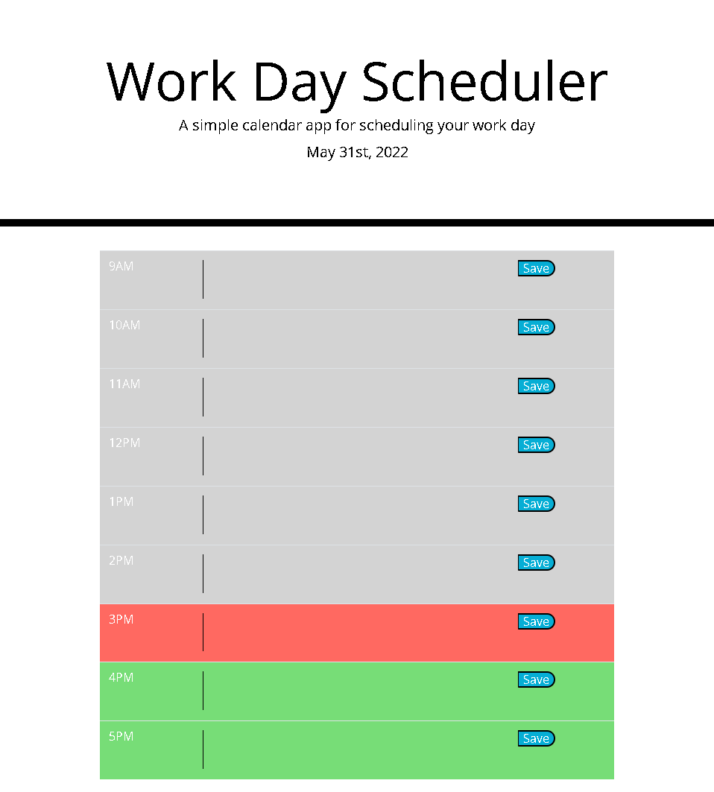

# Work-Day-Scheduler

## Table of Contents
1. [Description](#description)
2. [Visuals](#visuals)
3. [Resources](#resources)

## Description

I created a work day scheduler where you can locally store events for different times of the day. The current date is always displayed at the top of the page, followed by a table which includes one section per hour from 9AM to 5PM. The rows of these tables include a text area and a save button, which saves the inputed text into local storage. The hourly rows also change colors based on the current time.

## Visuals

## Resources

[Live Site](https://vmalie3.github.io/work-day-scheduler/)

[Repository](https://github.com/vmalie3/work-day-scheduler/issues)